# X509-Certificate-Cleopatra-CrypTool-Lab

## 1. Wstęp i Cel Laboratorium

Celem tego laboratorium jest praktyczne przećwiczenie procesu generowania pary kluczy kryptograficznych, eksportowania ich oraz tworzenia żądania podpisania certyfikatu (CSR - Certificate Signing Request) w standardzie X.509. Wykorzystano do tego narzędzia CrypTool 1 (do generowania i eksportu kluczy) oraz Kleopatra (do utworzenia CSR). Dodatkowo podpisywanie/szyfrowanie wraz z odszyfrowaniem certyfikatu.

## 2. Generowanie Pary Kluczy RSA i Eksport (CrypTool 1)

Pierwszym krokiem było wygenerowanie asymetrycznej pary kluczy RSA oraz ich bezpieczny eksport do pliku w formacie PKCS#12 (.p12), który zawiera zarówno klucz publiczny, jak i prywatny.

1.  **Inicjacja generowania kluczy:**
    * Wybrano opcję generowania pary kluczy z menu: `Podpis cyfrowy` -> `PKI` -> `Generowanie/Import klucza`.

    

2.  **Konfiguracja parametrów klucza RSA:**
    * Wybrano algorytm RSA.
    * Ustawiono długość klucza na 2048 bitów.
    * Podano podstawowe dane użytkownika (Nazwisko, Imię).
    * Ustawiono kod PIN dla ochrony klucza.

    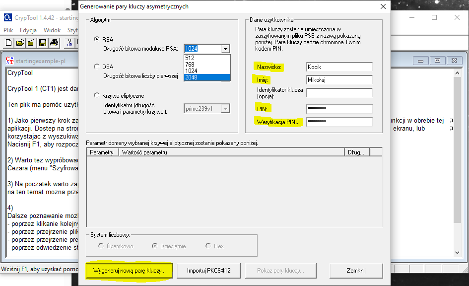

3.  **Potwierdzenie wygenerowania:**
    * System potwierdził pomyślne zapisanie nowej pary kluczy.

    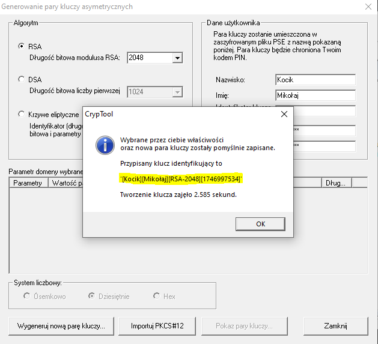

4.  **Podgląd kluczy i certyfikatu (wewnętrznego CrypTool):**
    * Możliwość podejrzenia parametrów klucza publicznego oraz podstawowych informacji o powiązanym (prawdopodobnie self-signed) certyfikacie w CrypTool.

    
    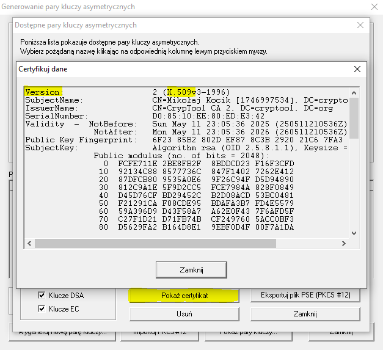

5.  **Eksport pary kluczy do pliku PKCS#12 (.p12):**
    * Wybrano opcję "Eksportuj plik PSE (PKCS#12)".
    * Podano wcześniej zdefiniowany kod PIN oraz nowy kod PIN dla pliku .p12 w celu jego zabezpieczenia.

    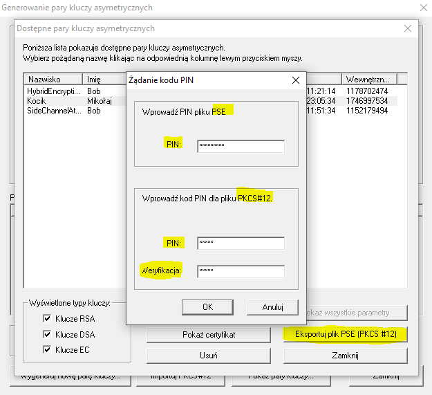

6.  **Zapisanie pliku .p12:**
    * Wskazano lokalizację zapisu i potwierdzono nazwę pliku.

    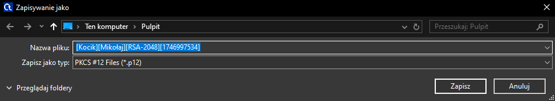

7.  **Wynik:**
    * Plik .p12 zawierający parę kluczy został zapisany na dysku.

    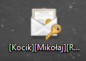

## 3. Utworzenie dokumentu CSR za pomocą programu "Kleopatra" z żądaniem certyfikatu X.509 

Certyfikaty X.509 są standardem w systemach zarządzania kluczami publicznymi (PKI) i służą
do zapewnienia autentyczności komunikacji w sieci. Zgodnie z RFC 5280, certyfikat X.509
składa się z następujących głównych elementów:
1. Wersja - określa wersję certyfikatu, np. wersja 3 (wymaga rozszerzeń).
2. Numer seryjny - unikalny identyfikator przypisany przez Centrum Certyfikacji (CA) dla
każdego certyfikatu.
3. Algorytm podpisu - algorytm używany przez CA do podpisania certyfikatu (np. RSA,
ECDSA).
4. Dane właściciela (Subject) - zawiera nazwę organizacji, jednostki organizacyjnej,
adres e-mail itp.
5. Dane wystawcy (Issuer) - dane CA, które wystawiło certyfikat.
6. Okres ważności - określa czas, w którym certyfikat jest ważny (data rozpoczęcia 
i zakończenia).
7. Klucz publiczny właściciela - klucz, który jest używany do weryfikacji podpisu
cyfrowego lub szyfrowania.
8. Podpis cyfrowy - podpis wystawcy (CA), który zapewnia integralność certyfikatu.
9. Rozszerzenia - dodatkowe informacje, takie jak cele certyfikatu, alternatywne nazwy
DNS itp.

Po wyeksportowaniu pary kluczy z użyciem narzędzia "CrypTool 1" do pliku .p12, kolejnym krokiem było utworzenie żądania podpisania certyfikatu (CSR) w programie Kleopatra. To żądanie zawiera informacje o podmiocie, dla którego certyfikat ma zostać wystawiony, oraz klucz publiczny. Następnie jest ono przesyłane do Urzędu Certyfikacji (CA) w celu podpisania, jednak ta sekcja nie znaduje się w tym labie.

1. Tworzenie nowego żądania certyfikatu S/MIME
   *Po kliknięciu w sekcję 'Plik' przechodzimy do w.w. opcji aby utworzyć żądanie certyfikacji

    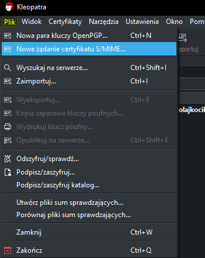

2. Konfiguracja parametrów certyfikatu
   * wymaganymi polami jest nazwa publiczna (ON) wraz z adresem e-mail (EMAIL), jednak dodatkowo uzupełniłem dane testowo, co do takich pól jak. m.in.: miejscowość (L), Jednostka organizacyjna (OU), Organizacja (O), Kod kraju (C) aby odzwierciedlić pełny skrypt/zapis naszego żądania.
  
   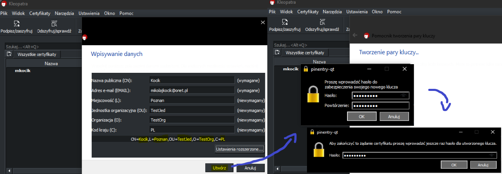

3. Zapis żądania certyfikatu do pliku
   * Generalnie powszechnym krokiem jest również wysłanie żądania certyfikatu przez e-maila do urzędzu certyfikacji jednak z      powodów oczekiwania nie będę tego robił w tym labie.

   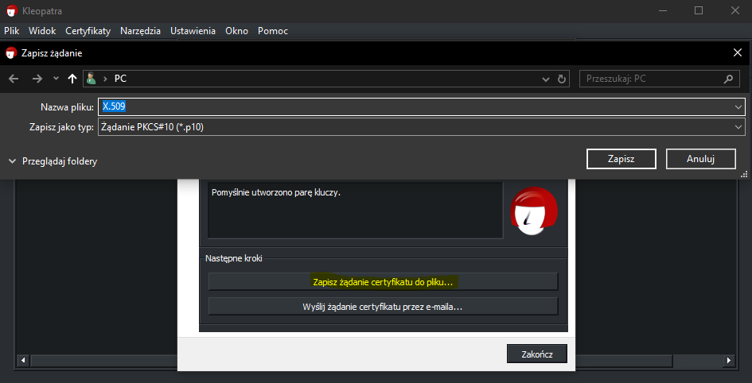

4. Podgląd utworzonego żądania X.509

   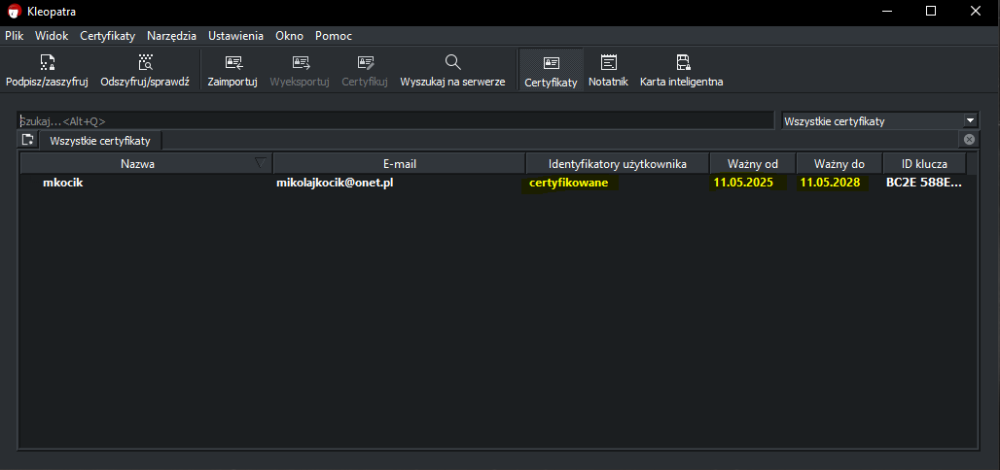

## 4. Szyfrowanie/Deszyfrowanie plików oraz cyfrowy podpis

Zanim przejdziemy do następnej sekcji labu, chciałbym krótko omówić na czym polega szyfrowanie kluczem symetrycznym i asymetrycznym.

**Szyfrowanie z kluczem symetrycznym**

Jedna z metod mniej skutecznych, ponieważ do zaszyfrowania i odszyfrowania wiadomości nadawca i odbiorca posiłkują się tym samym kluczem co zwiększa ryzyko dostępu do danych przez niewłaściwą jednostkę. Jeżeli obie osoby używają tego samego klucza, musimy go dostarczyć aby osoba trzecia go nie przechwyciła inaczej wiadomość może być nieświadomie zmodyfikowana, podmieniona bez świadomości nadawcy i odbiorcy a co najważniejsze i najgroźniejsze to wyciek poufnych danych.

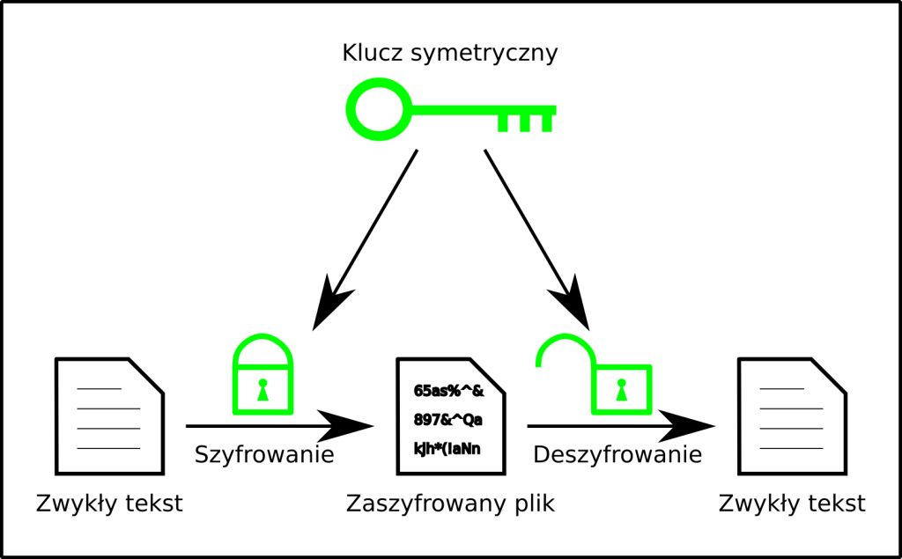

Abyśmy mieli pewność, że wiadomość jest bezpieczna klucz musi być bardzo trudny, co angażuje dodatkowe zasoby. Klucz nie 
do złamania powinien być jednorazowy i mieć taką samą długość jak szyfrowana wiadomość.

**Szyfrowanie z klcuzem asymetrycznym**

Szyfrowanie asymetryczne rozwiązuje problem dystrybucji klucza, z którym mieliśmy problem przy kryptografii symetrycznej. Odczytanie zaszyfrowanych w ten sposób informacji jest możliwe tylko w przypadku przejęcia klucza prywatnego, czyli de facto przejęcia kontroli nad urządzeniem.

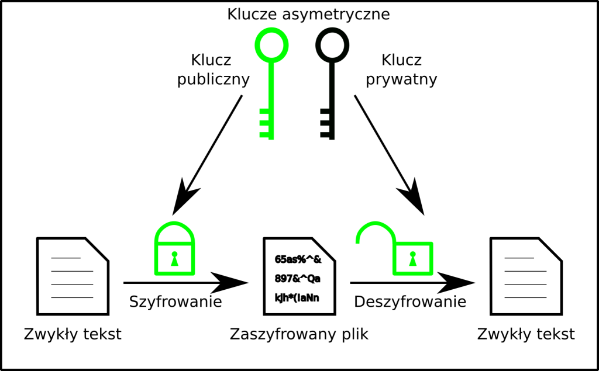

1. Zaszyfrowanie pliku tekstowego:

Szyfrowanie to proces przekształcania danych w sposób, który uniemożliwia ich nieuprawniony dostęp. Dane są 
przekształcane  w nieczytelny format (zaszyfrowany) za pomocą algorytmu kryptograficznego i klucza, a następnie mogą być 
rozszyfrowane 
tylko przez osoby posiadające odpowiedni klucz. 
  
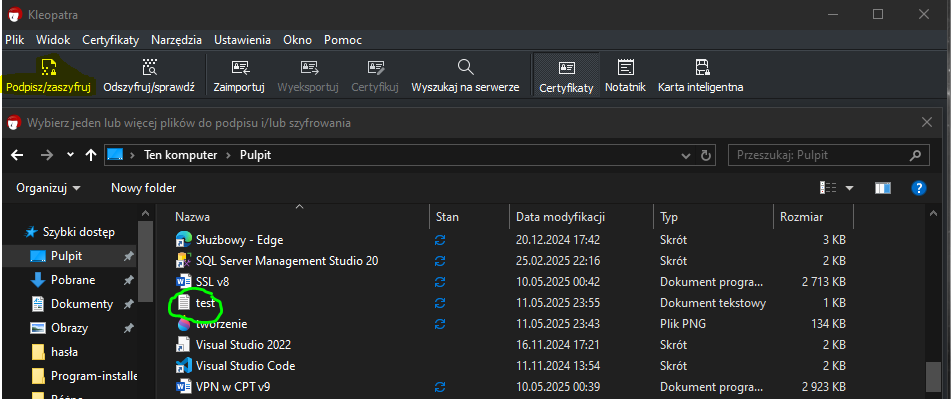

2. Proces szyfrowania pliku tekstowego:

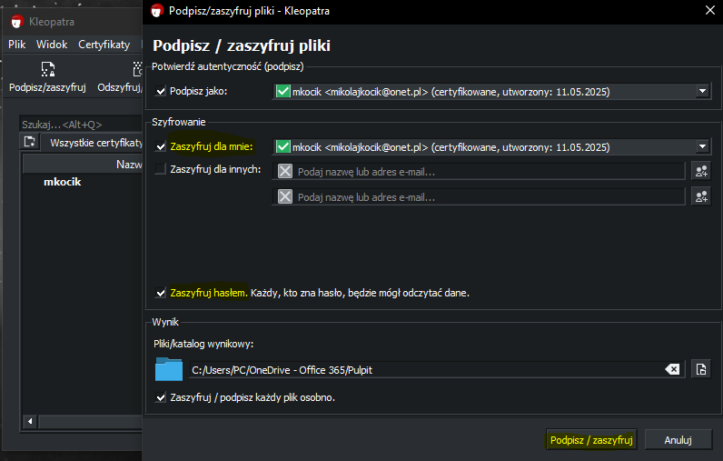
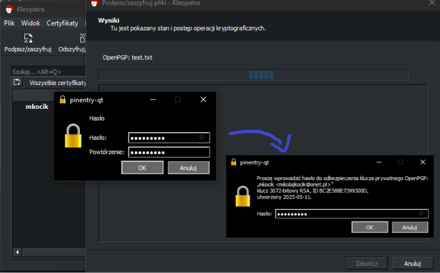
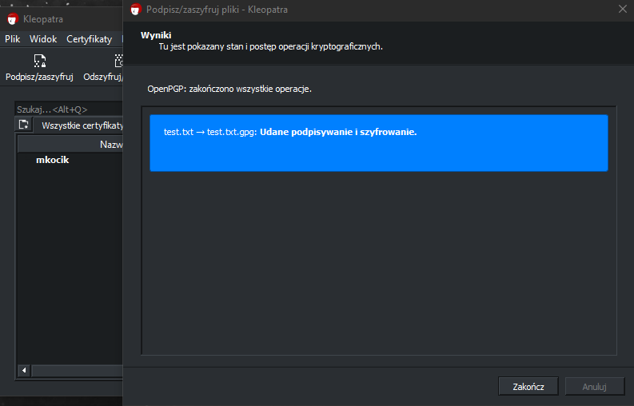

3. Odszyfrowanie pliku tekstowego + weryfikacja podpisu z certyfikatem:

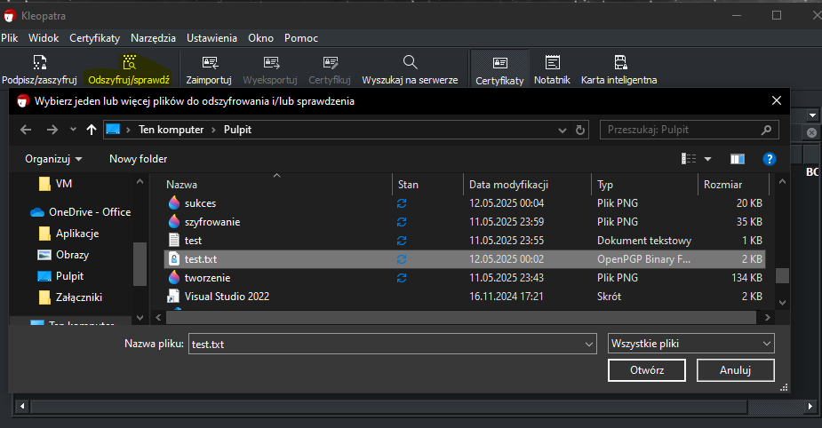
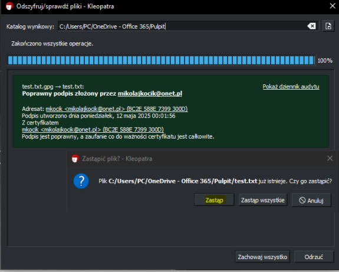

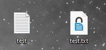

